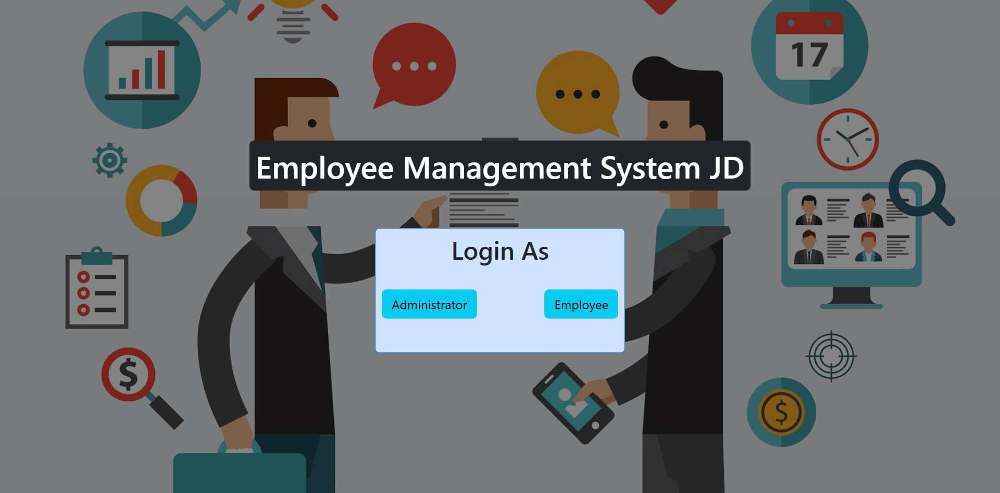
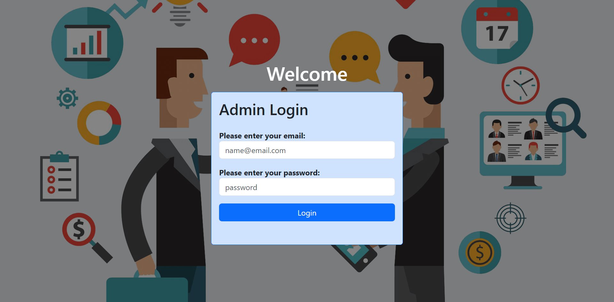
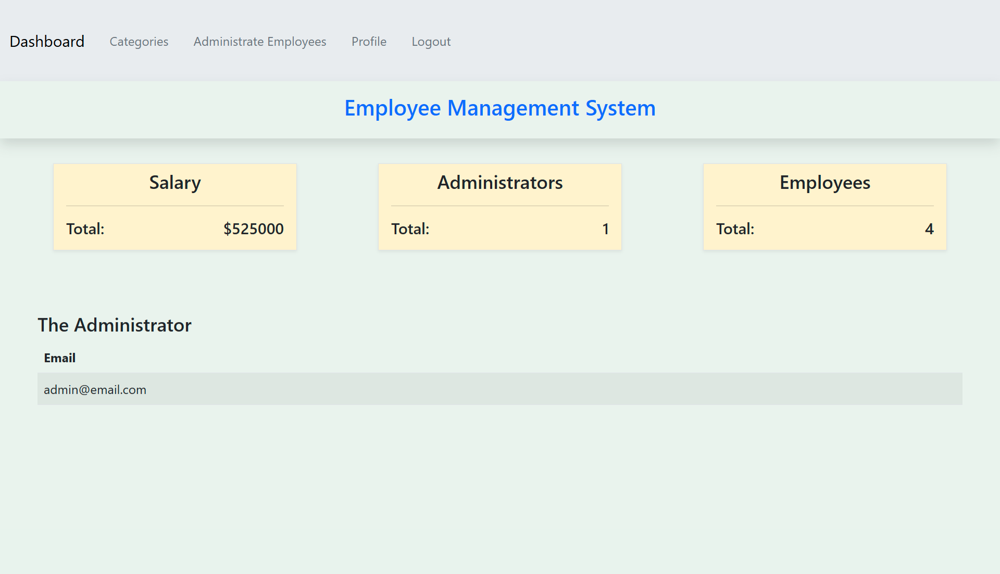
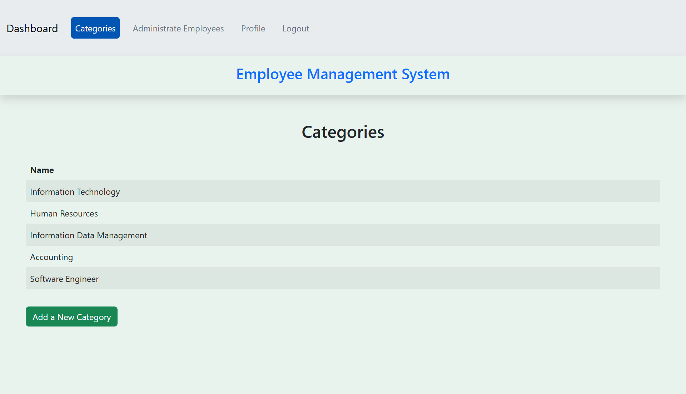
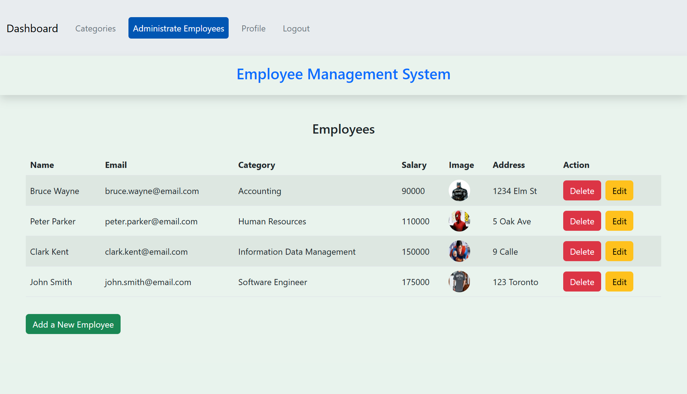
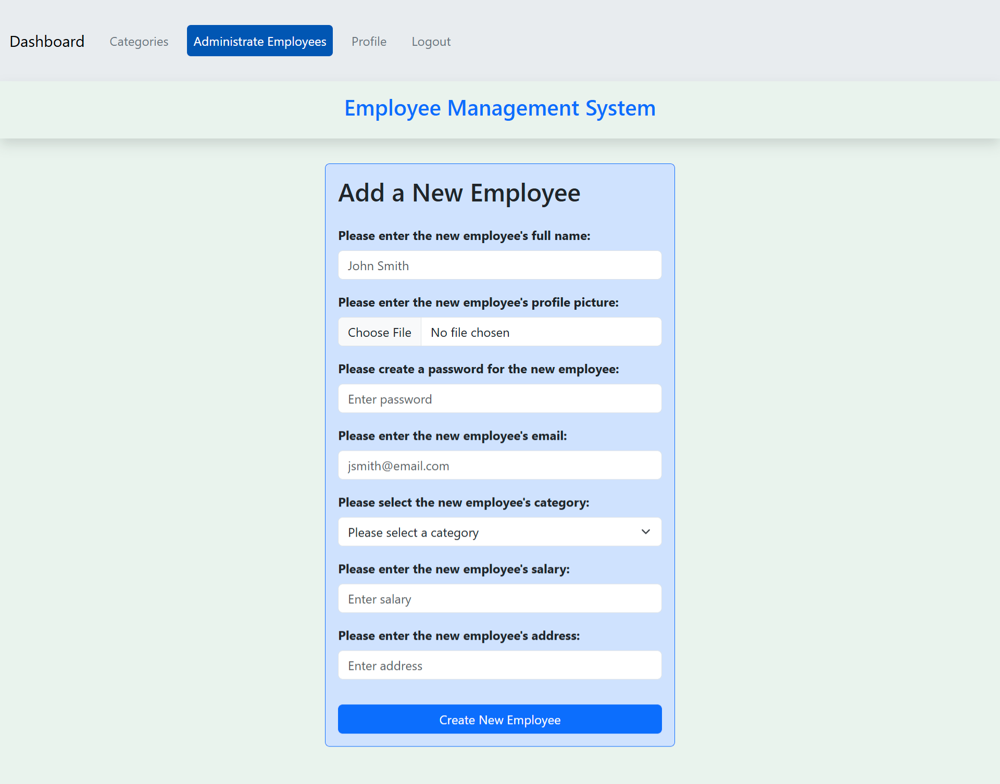
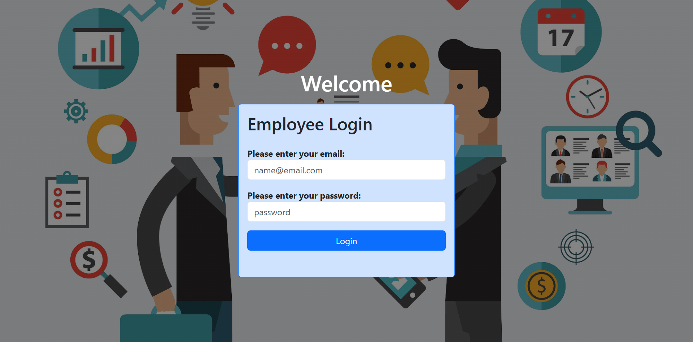
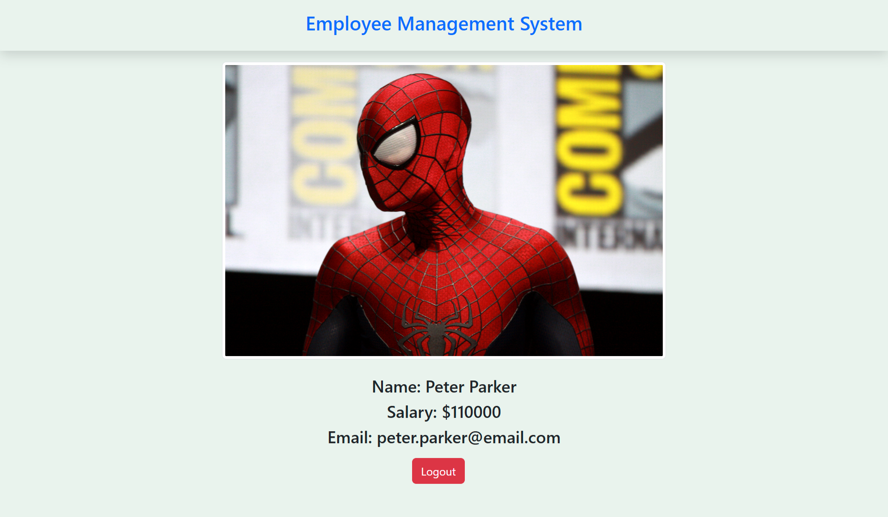

# Project Title
Employee Management System JD

## Installed Packages 
- Install all the packages by using:
    `$ npm install`

## How to run this project?
- To run the client side: `$ npm run dev`
- To run the server side: `$ nodemon server.js`

## Overview

Employee Management System JD app is a comprehensive tool designed to administrate and automate various 
business needs in an organization. It allows businesses to effectively manage employees data, create, modify, and delete employees, manage departments, salary budget overview, and user authentication. The app will have two main sites: Admin Mode and Employee Mode. It is a user-friendly solution between management teams and employees. 

### Problem

This application is designed to facilitate and provide user-friendly solutions to organizations. Currently, many companies have difficulties tracking and managing employees data, forcing them go trough the time consuming process of searching for records and information in different locations. This application is developed with the objective to have centralized data, improve communication between management and employees, track employees salaries and organization's budges, and show statistical insights about the company size and their employees.   

### User Profile

The initial interphase of the app is to sign-in as an Admin or an Employee. Only admins can create employees and categories. Moreover, they are the only ones who can have access to the dashboard.

- Admins: 
    - Manage and administrate employees data and accounts
    - Look for statistical information about the company

- Employees: 
    -  Check respective profile information


### Features

- Admins Features: 
    - Dashboard overview about the organization total salary expenses
    - Employees statistics information about the organization 
    - Create, delete, and edit employees within the organization
    - Create employees departments 

- Employees feature
    - Overview of current employee profile information
    - Edit current employee contact information

## Implementation

1. Back end development
    - Routes
    - Database
    - Seeds and migrations
2. Front end development 
    - Components 
    - Features
    - API calls
3. Integration between front and back end
4. Fix bugs
5. Present

### Tech Stack
<p align="center">
  <a href="https://skillicons.dev">
    
  </a>
</p>

- #### Client Libraries
    - axios
    - bootstrap
    - popper.js
    - react
    - react-dom
    - react-router-dom

- ### Server Libraries
    - knex
    - bcrypt
    - cookie-parser
    - cors
    - dotenv
    - multer
    - mysql2
    - nodemon
    - path
    - express
    - jsonwebtoken


### APIs

No external APIs will be used for this project

### Sitemap
1. Landing Page: Select if you are login as an admin or employee
2. Admin Login form or Employee Login form
3. Admin Dashboard (home page): shows a statistical summary of the company number of employees, number of admins and current total salary.
4. Admin Departments: allows admin to modify the departments of the organization
5. Admin Employees: Management, create, edit, and delete employees
6. Admin Profile: admin profile overview
7. Admin Logout: Logs out admin
8. Employee Profile (home page): current employee profile overview
9. Employee Edit: Allows to edit employee contact information
10. Employee logout: logs out employee

### Display

#### Landing Page


#### Admin Login Form


#### Admin Dashboard


#### Admin Departments 


#### Admin Employees


#### Admin Create Employee


#### Employee Login Form


#### Employee Profile



### Data


### Endpoints

**GET /employee_count** 
- Gets the total number of employees

Response: 
```
    {
        "total": 10
    }
```

**GET /employee**
- Get's employees details


Response: 
```
    [
        {
            full_name: "John Smith",
            image: "imageUrl"
            email: "john.smith@email.com",
            address: "123 Toronto Road",
            salary: 124567
            department: "IT"        
        },
        ...
    ]
```

**GET /employee/:id**
- Get's employees details

Parameters: 
- id: employee id

Response: 
```
    {
        full_name: "John Smith",
        image: "imageUrl"
        email: "john.smith@email.com",
        address: "123 Toronto Road",
        salary: 124567
        department: "IT"        
    }
```

**GET /departments**
- Gets a list of parameters

Response: 
```
    [
        {
            id: 1,
            name: "IT"
        },
        ...   
    ]
```

**POST /login/admin**
- Login as an admin

Parameters: 
- email: admin's email
- password: admin's password

Response: 
```
{
    "token": "chwui42342bjk3b4n2il3b4uio2342..."
}
```

**POST /login/employee**
- Login as an employee

Parameters: 
- email: employee's email
- password: employee's password

Response: 
```
{
    "token": "chwui42342bjk3b4n2il3b4uio2342..."
}
```

**PUT /edit_employee/:id**
- Edits employee information

Parameters:
- Employee's id

Response: 
```
    {
        full_name: "John Smith",
        image: "imageUrl"
        email: "john.smith@email.com",
        address: "123 Toronto Road",
        salary: 124567
        department: "IT"        
    }
```

**DELETE /delete_employee/:id**
- Deletes an employee

Parameters:
- Employees id


### Auth

- JWT auth
    - Before any user (admin and/or employee) access to the platform, they must sign in
    - Only the admin is capable of creating user accounts 
    - JWT will be stored in local storage, and will be remove when user logs out 
    - Admin interphase is different than employees interphase. Admins have more control to manage organizations data

## Roadmap

- Create Backend
    - Node js and Express with routing and placeholder responses
    - Create mySQL database
    - Create seeds and migrations
    - Setup and define foreign keys

- Client Site
    - Built landing page   
    - Create a boiler plate
    - Define routes 
    - Create components

- Integrate front end with back end

- Create login form for Admins and Employees
    - Integrate POST requests

- Feature: Implement JWT tokens
    - Server: Update expected requests / responses on protected endpoints
    - Client: Store JWT in local storage, include JWT on axios calls

- Create Admin Features:
    - Dashboard
    - Current employees
    - Departments
    - Manage employees
    - Logout

- Employee Feature
    - View current employee profile
    - Modify current employee contact information

- Bug fixes
- Demo day

## Nice-to-haves

- Include statistical graphs and visuals to facilitate and visualize data in the dashboard for:
    - Number of admins
    - Number of employees
    - Salary 
- Include demographic information about employees such as: sex, age, and race anonymously  
- Allow any user to restore password in case they forget it  
- Incorporate email account to the app so that users could send emails directly from there

## Long Term Features
- Incorporate AI to automate and make suggestions on future decisions regarding company's employees demand and salaries
- Generate monthly .csv reports showing company progress and insights  
- Integrate other analytical tools such as Power BI

