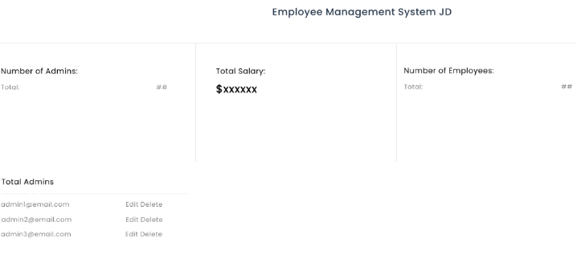

# Project Title
Employee Management System JD

## Overview

Employee Management System JD app is a comprehensive tool designed to administrate and automate various 
business needs in an organization. It allows businesses to effectively manage employees data, create, modify, and delete employees, manage departments, salary budget overview, and user authentication. The app will have two main sites: Admin Mode and Employee Mode. It is a user-friendly solution for between management teams and employees. 

### Problem

This application is designed to facilitate and provide user-friendly solutions to organizations. Currently, many companies have difficulties tracking and managing employees data, forcing them go trough the time consuming process of searching for records and information in different locations. This application is developed with the objective to have centralized data, improve communication between management and employees, track employees salaries and organization's budges, and show statistical insights about the company size and their employees.   

### User Profile

Who will use your app? How will they use it? Any special considerations that your app must take into account.
The initial interphase of the app is to sign-in as an Admin or an Employee. Only admins can create employees and admins accounts. 

- Admins: 
    - Manage and administrate employees data and accounts
    - Look for statistical information about the company

- Employees: 
    -  Check respective profile information

### Features

- Admins Features: 
    - Dashboard overview about the organization total salary expenses
    - Employees statistics information about the organization 
    - Create, delete, and edit employees within the organization
    - Create, delete, and edit employees departments 

- Employees feature
    - Overview of current employee profile information
    - Edit current employee contact information

## Implementation

### Tech Stack

- React
- JavaScript
- MySQL
- Node.js
- Express
- Bootstrap

- #### Client Libraries
    - axios
    - react
    - react-dom
    - react-router-dom

- ### Server Libraries
    - knex
    - express
    - bcrypt for password hashing 
    - jsonwebtoken

### APIs

No external APIs will be used for this project

### Sitemap
1. Landing Page: Select if you are login as an admin or employee
2. Admin Login form or Employee Login form
3. Admin Dashboard (home page): shows a statistical summary of the company number of employees, number of admins and current total salary.
4. Admin Departments: allows admin to modify the departments of the organization
5. Admin Employees: Management, create, edit, and delete employees
6. Admin Profile: admin profile overview
7. Admin Logout: Logs out admin
8. Employee Profile (home page): current employee profile overview
9. Employee Edit: Allows to edit employee contact information

### Mockups

#### Landing Page

#### Admin Login Form

#### Employee Login Form

#### Admin Dashboard

#### Admin Departments 

Provide visuals of your app's screens. You can use tools like Figma or pictures of hand-drawn sketches.

### Data

Describe your data and the relationships between them. You can show this visually using diagrams, or write it out. 

### Endpoints

List endpoints that your server will implement, including HTTP methods, parameters, and example responses.

### Auth

Does your project include any login or user profile functionality? If so, describe how authentication/authorization will be implemented.

## Roadmap

Scope your project as a sprint. Break down the tasks that will need to be completed and map out timeframes for implementation. Think about what you can reasonably complete before the due date. The more detail you provide, the easier it will be to build.

## Nice-to-haves

Your project will be marked based on what you committed to in the above document. Under nice-to-haves, you can list any additional features you may complete if you have extra time, or after finishing.
